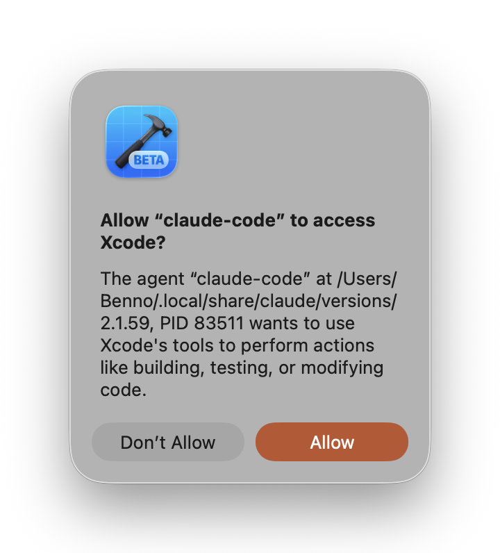
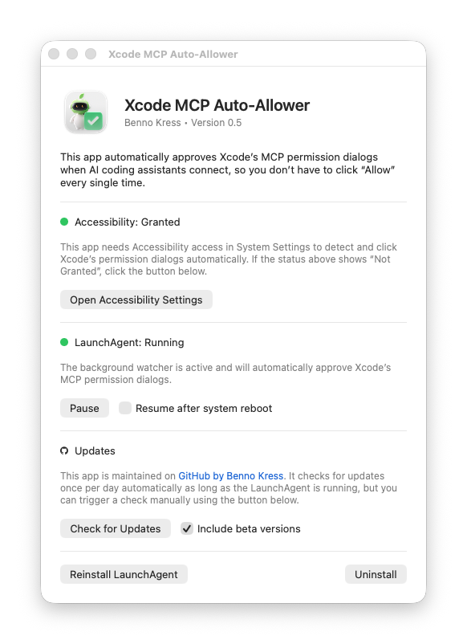

# Xcode MCP Auto-Allower

Are you annoyed by this permission dialog already?

<p align="center">
  
</p>

Every time an AI coding assistant connects to Xcode via MCP, this dialog pops up and interrupts your flow. **Xcode MCP Auto-Allower** takes care of it by automatically clicking "Allow" for you. Every single time, in the background, without you having to do anything.

## Installation

1. Download the latest DMG from [Releases](https://github.com/bennokress/xcode-mcp-auto-allower/releases)
2. Open the DMG and drag **Xcode MCP Auto-Allower** to `/Applications`
3. Launch the app once
4. Grant **Accessibility** permission when prompted (System Settings > Privacy & Security > Accessibility)

## Features

**Automatically allowing MCP connection requests** is activated right after the installation steps above. It **stays active forever** and **doesn't require the app to be opened**. It even **survives reboots** of macOS, because the app registers a LaunchAgent in the system that runs silently in the background.

If you ever want to see connection requests again, you have two options: **Pause the agent temporarily** and resume it whenever you're ready, or **pause it indefinitely** by unchecking the "Resume after system reboot" option while paused. This way it won't come back until you manually resume it. You can also **uninstall the app** entirely, which automatically removes the LaunchAgent from the system along with all related files.

Both pausing and uninstalling can be done from the app's main window. The window also shows **status indicators** for the Accessibility permission and the LaunchAgent registration, so you can tell at a glance if everything is working correctly. If something seems off, you have the option to **reinstall the LaunchAgent** with a single click. The app also supports **automatic update checks** and lets you **include beta versions** if you want to stay on the cutting edge.

<p align="center">
  
</p>

## Technical Details

The app is a lightweight macOS daemon written in pure Swift (~900 lines, no external dependencies). It uses the macOS Accessibility framework to detect and dismiss Xcode's MCP permission dialogs in a fully event-driven way. There is no polling and no timers, resulting in virtually zero resource usage while idle.

### How the Auto-Allow Works

1. The daemon monitors running applications via `NSWorkspace` notifications and attaches an `AXObserver` to each Xcode process (matched by bundle ID `com.apple.dt.Xcode`, which covers stable and beta versions alike)
2. The observer listens for `kAXWindowCreatedNotification` and `kAXFocusedWindowChangedNotification`
3. When a notification fires, the daemon scans the window's children for `AXStaticText` (body) and `AXButton` elements
4. If the body text contains "Xcode" **and** the window has both an "Allow" and a "Don't Allow" button, it's identified as an MCP permission dialog
5. The daemon calls `AXUIElementPerformAction(kAXPressAction)` on the "Allow" button

The dialog text is identical across all MCP agents (only the tool name varies), so this detection works universally without hard-coding agent names.

### LaunchAgent

The daemon runs via a LaunchAgent plist at `~/Library/LaunchAgents/com.bennokress.xcode-mcp-allower.plist`. It is configured with `RunAtLoad: true` (starts on login) and `KeepAlive: true` (respawns if the process crashes). The app binary is launched with a `--background` flag, which sets the activation policy to `.accessory` so it stays out of the Dock.

## Troubleshooting

### Want to See Logs?

The daemon logs to `~/Library/Logs/xcode-mcp-allower.log`. You can follow the log in real-time:

```bash
tail -f ~/Library/Logs/xcode-mcp-allower.log
```

Typical log entries include Xcode launch/termination events, observer attachment, dialog detection, and the result of clicking the Allow button.

### App Not Visible in Accessibility Settings?

Open the app once. On first launch it calls `AXIsProcessTrustedWithOptions` with the prompt option, which pre-registers the app in System Settings > Privacy & Security > Accessibility. You just need to flip the toggle to ON. If the entry still doesn't appear, try removing the app from `/Applications`, re-copying it from the DMG, and launching it again.

### Daemon Not Running?

Check whether the LaunchAgent is loaded:

```bash
launchctl list | grep xcode-mcp-allower
```

If no PID is shown, open the app and click **Reinstall LaunchAgent**. This deletes the existing plist, writes a fresh one pointing to the current app binary, and reloads it via `launchctl bootstrap`. You can also check the log file for error messages that might indicate the cause.

## Development

### Local Development

For local development the app compiles from source without code signing:

```bash
git clone https://github.com/bennokress/xcode-mcp-auto-allower.git
cd xcode-mcp-auto-allower
./Scripts/install.sh
```

This compiles the icon assets and Swift sources, creates an `.app` bundle at `~/Applications/Xcode MCP Auto-Allower.app`, writes the LaunchAgent plist, and loads the daemon. Requires Xcode Command Line Tools (`xcode-select --install`).

### Creating Your Own DMG File

To build a signed and notarized DMG for distribution:

```bash
# Set signing & notarization credentials
export DEVELOPER_ID="Developer ID Application: Your Name (TEAMID)"
export APPLE_ID="you@example.com"
export TEAM_ID="TEAMID"
export APP_PASSWORD="xxxx-xxxx-xxxx-xxxx"  # or @keychain:notarytool

./Scripts/build-dmg.sh
```

Alternatively, if you have a local keychain profile set up (`xcrun notarytool store-credentials "notarytool"`), the script will auto-detect it and you only need to run `./Scripts/build-dmg.sh`. The signed and notarized DMG is output to `Distribution/`.

---

<sub>This project is not affiliated with, endorsed by, or connected to Apple Inc. "Xcode", "macOS", and "Mac" are trademarks of Apple Inc., registered in the U.S. and other countries. All trademark rights belong to their respective owners.</sub>
